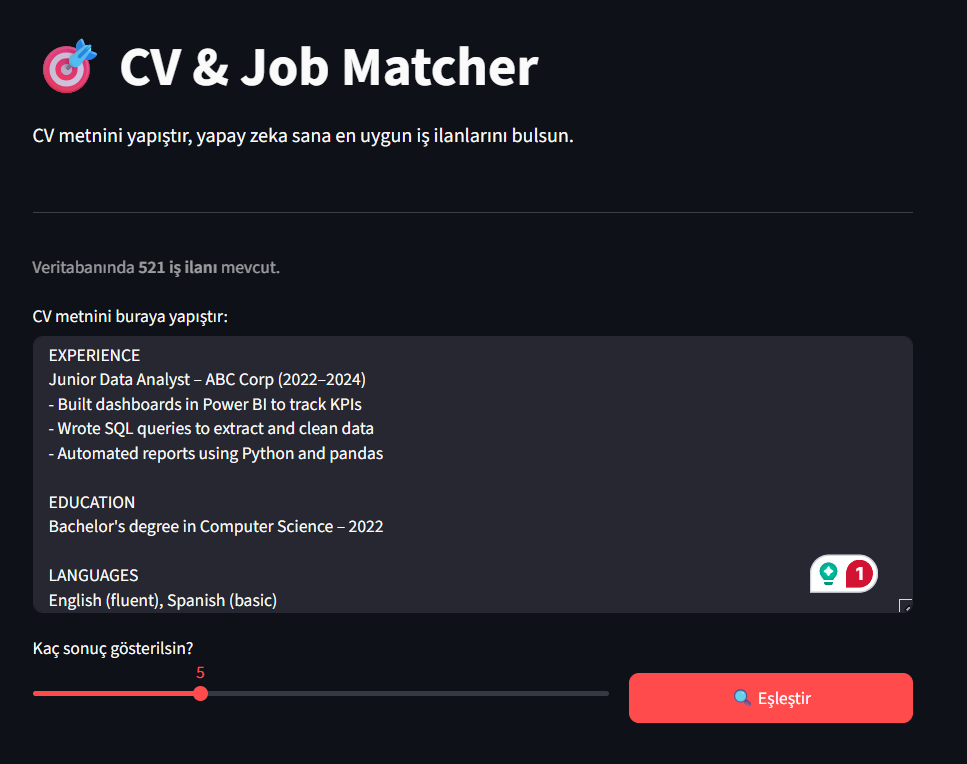
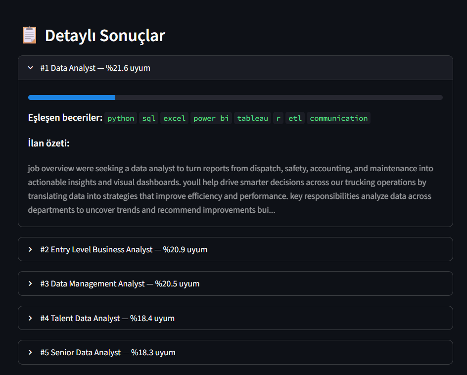
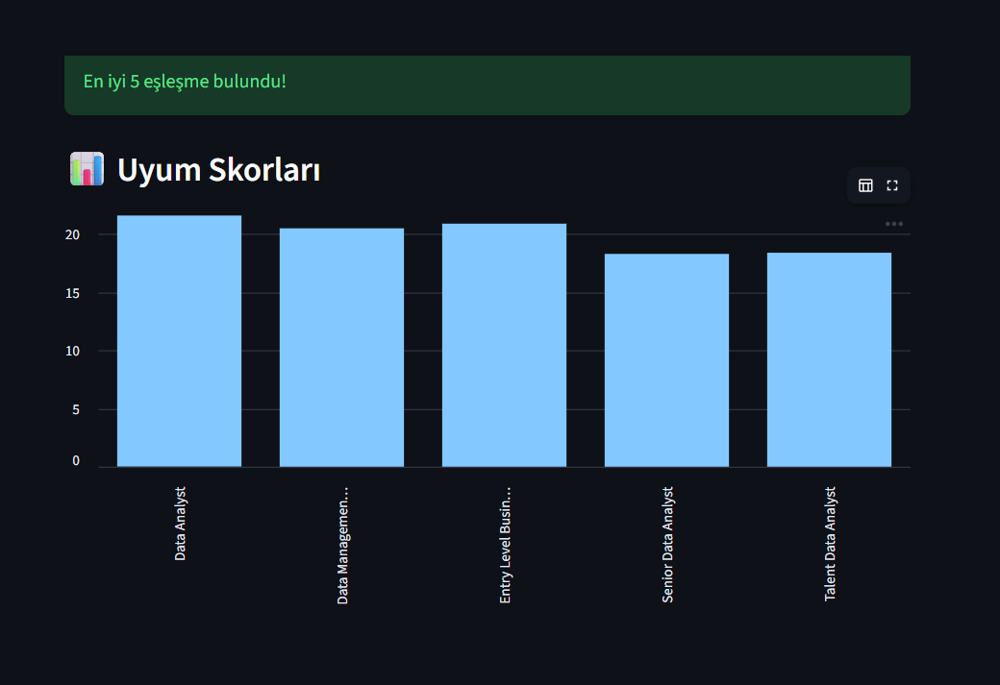

# 🎯 CV & Job Matcher — AI-Powered Career Recommender

An NLP-based job recommendation system that analyzes a CV and matches it against 521 real job listings using TF-IDF vectorization and cosine similarity.

Built as an AI course project using Python, scikit-learn, spaCy, and Streamlit.

---

## 📸 Demo

### Ana Ekran


### Uyum Skorları


### Eşleşme Detayları


---

## ✨ Features

- **NLP-based CV analysis** — spaCy tokenizes and lemmatizes input text
- **TF-IDF vectorization** — converts CV and job descriptions into numerical vectors
- **Cosine similarity matching** — ranks 521 job listings by relevance
- **Skill extraction** — highlights which skills from the CV matched each job
- **Interactive bar chart** — visualizes match scores at a glance
- **Fast results** — dataset is cached on first load, subsequent queries are instant

---

## 🛠️ Tech Stack

| Layer | Technology |
|---|---|
| Language | Python 3.10+ |
| NLP | spaCy (`en_core_web_sm`) |
| ML | scikit-learn (TF-IDF, cosine similarity) |
| UI | Streamlit |
| Data | pandas |

---

## 📂 Project Structure

```
cv_matcher/
├── app.py           # Streamlit UI
├── matcher.py       # NLP + ML logic
├── data.csv         # Job listings dataset (521 entries)
├── requirements.txt
└── README.md
```

---

## 🚀 Getting Started

**1. Clone the repository**
```bash
git clone https://github.com/umutilhann/cv-matcher.git
cd cv-matcher
```

**2. Install dependencies**
```bash
pip install -r requirements.txt
python -m spacy download en_core_web_sm
```

**3. Run the app**
```bash
streamlit run app.py
```

Open `http://localhost:8501` in your browser.

---

## 🧠 How It Works

```
User pastes CV text
        ↓
spaCy cleans & lemmatizes text
        ↓
TF-IDF converts CV + 521 job descriptions into vectors
        ↓
Cosine similarity scores CV against every job listing
        ↓
Top N matches displayed with skill highlights
```

**Why TF-IDF + cosine similarity?**  
TF-IDF (Term Frequency–Inverse Document Frequency) gives higher weight to words that are important in a document but rare across all documents — perfect for identifying key skills. Cosine similarity then measures the angle between two vectors, making it length-independent and ideal for text comparison.

---

## 📊 Dataset

- **Source:** Kaggle — Job Descriptions Dataset
- **Size:** 521 job listings
- **Columns:** `Job Title`, `Description`
- **Domain:** Primarily data/analyst roles

---

## 🔮 Future Improvements

- Add resume PDF upload support
- Expand dataset with more job categories
- Use sentence embeddings (SBERT) for semantic matching
- Deploy on Streamlit Cloud

---

## 👤 Author

**Umut**  
Computer Engineering Student — Omer Halisdemir University  
